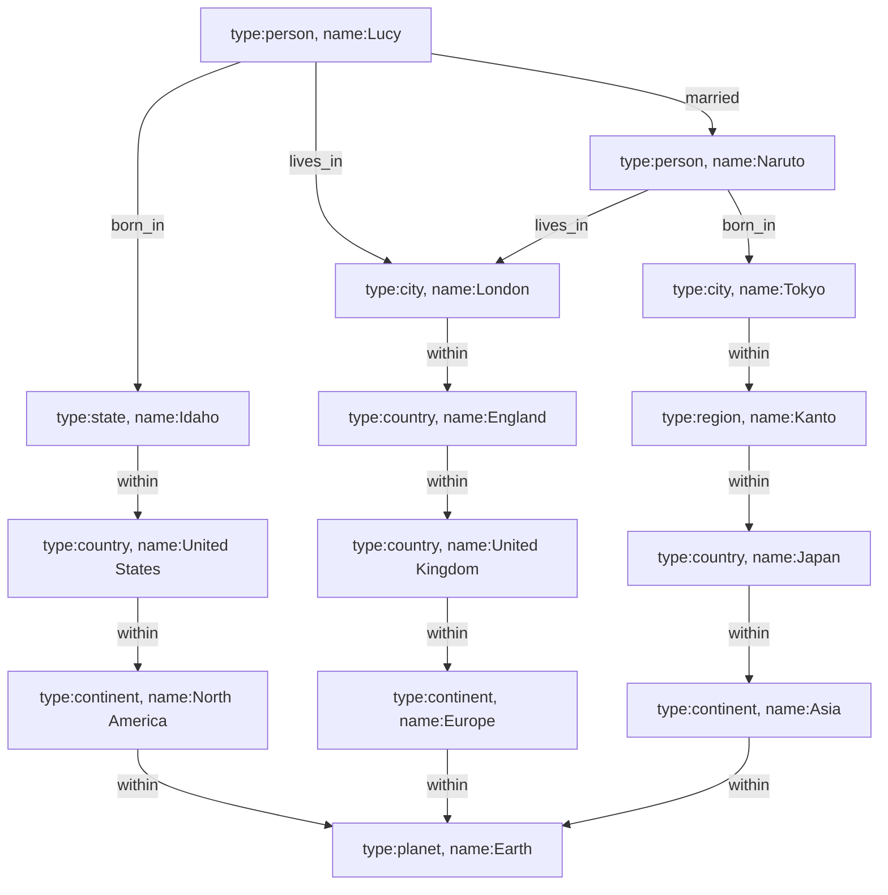

# 梓峰笔记-数据密集型应用系统设计

[toc]


## 1 数据系统基础


### 1.1 可靠、可扩展与可维护的应用系统

大部分应用系统都包含以下模块：

* 数据库：用以存储数据，这样之后应用可以再次访问。
* 缓存：缓存那些复杂或操作代价昂贵的结果，以加快下一次访问。
* 索引（搜索引擎）：用户可以按关键字搜索数据并支持各种过滤。
* 流式处理：持续发送消息至另一个进程，处理采用异步方式。
* 批处理：定期处理大量的累积数据。

**应用系统（数据系统）应追求的核心设计目标：可靠性（Reliability）、可扩展性（Scalability）、可维护性（Maintainability）。**

一般应用系统架构如下：


#### 1.1.1 可靠性

可靠性定义：

> 当出现意外情况如硬件故障、软件故障、人为故障等，系统应可以继续正常运转。虽然性能可能有所降低，但确保功能正确。

**系统容错能力越强，系统可靠性越好。**

容错（fault-tolerant），又称：弹性（resilient）。

容错三大方向：

* 硬件故障：拔电源、切光缆、烧机房、主板氧化、硬盘空间不足
* 软件故障：逻辑bug、空指针、编译异常、运行异常、IO错误、死锁、网络异常
* 人为故障：错误配置、删库跑路、错误发布、团队配合不足、流量误判


#### 1.1.2 可扩展性

可扩展性定义：

> 随着规模的增长，例如数据量、流量或复杂性，系统应以合理的方式来匹配这种增长。

**系统99.9%响应时间越短 -> 系统性能越高 -> 系统负载能力越强 -> 系统可扩展性越好。**

常见响应时间指标：p50、p90、p95、p99、p999。

应对负载增加的方法：

* 垂直扩展：单机增强，趋向于成本高昂但系统复杂度低。
* 水平扩展：多机分布，趋向于成本低廉但系统复杂度高。

可扩展性举例，推特的消息推拉模型：

拉模型：

follow表

| follower_id | followee_id |
| ----------- | ----------- |
| 17055506    | 12          |

users表

| id   | screen_name | profile_image |
| ---- | ----------- | ------------- |
| 12   | Jack        | 1234567.jpg   |

tweets表

| id   | sender_id | text            | timestamp  |
| ---- | --------- | --------------- | ---------- |
| 20   | 12        | fly to the moon | 1142974214 |

```sql
SELECT tweets.*, users.* FROM tweets
  JOIN users ON tweets.sender_id = users.id
  JOIN follows ON follows.followee_id = users.id
  WHERE follows.follower_id = current_user
```

*推模型：*


拉模型有读压力，推模型有写压力。对常见大部分粉丝量少的用户均用推模型，对少部分大V名人用拉模型。在推拉混合模型下，主页消息列表通常是按时间合并排序的。


#### 1.1.3 可维护性

可维护性定义：

> 随着时间的推移，许多新的人员参与到系统开发和运维，以维护现有功能或适配新场景等，系统都应高效运转。

**系统越具备可运维性、简单性、可演化性，系统可维护性越好。**

软件系统的三个设计原则：

* 可运维性：方便运维团队保持系统平稳运行。需运维自动化。
* 简单性：简化系统复杂性，使新工程师能够轻松理解系统。需小工程。
* 可演化性：后续工程师能够轻松滴对系统进行改进，并根据需求变化将其适配到非典型场景，也称为可延伸性、易修改性或可塑性。需重构。


#### 1.1.4 关键点

可靠性、可扩展性、可维护性都是数据密集型应用系统设计的基本原则。

* 想要保持高可靠性，就要做好系统容错机制，避免单点故障，系统间调用要有熔断机制，而且面对高峰流量时期的挑战，还需要做好削峰填谷的消息队列支持，以及服务降级、限流等措施。

* 想要保持高可扩展性，就要做好系统水平扩容的准备，任何有共享资源竞争的地方都应考虑是否增加分布式锁的支持，在水平扩容的过程中也要准备好运维相关的配套支持，包括应用的打包、测试、发布的流水线作业支持，以及灰度环境的支持。为了更好地支持高可扩展性，还要考虑是否把应用部署在容器环境中，借助k8s瞬速提升系统可伸缩能力。

* 想要保持高可维护性，就要做好运维自动化、运维平台化，保持项目结构的简单，易于重构，并且尽可能降低新人的培训成本。


### 1.2 数据模型与查询语言

这一章直接解答了什么时候用关系型数据库，什么时候用非关系型数据库。


#### 1.2.1 关系模型与文档模型

**关系型数据库**

优点：

* 80年代中期崛起，占据主导地位三十多年，广泛用于大部分商业数据处理。
* 由RDBMS和SQL组成，存储与查询双剑合璧，Schema标准化数据，SQL简单易用。
* 击败最早的对象数据库--XML数据库，战胜原因：多对一和多对多的胜利。
* 千禧年后其应用范围扩展到在线发布、论坛、社交网络、电子商务、游戏、SaaS等。
* 有严谨的数学理论做支撑。

缺点：

* 对象与关系不匹配，OOP与SQL的世纪矛盾。
* ORM框架不仅没有化解矛盾，还增加了程序复杂性。
* 数据模型缺乏一对多的整体存储，模型分散且引用复杂。


**文档数据库**

优点：

* 支持一对多整体存储，模型聚合且无引用，类似JSON。
* 容易水平扩展，大规模部署，没有哈希的后顾之忧。
* 无Schema，单表多结构。

缺点：

* 虽然支持引用存储，但不支持引用查询。
* 重新发明了SQL，学习成本高，而且还不好用。
* 真实适用场景少，无数大神竞折腰。
* 无Schema，数据规范化管理困难。


**什么时候用关系型数据库？**

实体之间的关系存在相对依赖，实体之间的存储保持相对独立。

**什么时候用文档数据库？**

实体之间的关系存在相对独立，实体之间的存储保持相对依赖。


#### 1.2.2 数据查询语言

**SQL**

```sql
SELECT * FROM animals WHERE family = 'Sharks';
```

**CSS**

```css
li.selected > p {
  background-color: blue;
}
```

**MapReduce**

```javascript
function map(Element e) {
  return {
    key: e.key, 
    value: e.value
  };
}

// key: key
// values: [value, ...]
function reduce(key, values) {
  return Array.sum(values);
}
```


#### 1.2.3 图状数据模型

代表作：Neo4j

数学支撑：图论

适用范围：以关系为主的数据存储。

逻辑实现：邻接表

查询语言：Cypher

例子：

Cypher

```cypher
MATCH (:Order)<-[:SOLD]-(e:Employee)
RETURN e.name, count(*) AS cnt
ORDER BY cnt DESC LIMIT 10
```

SQL

```sql
SELECT e.EmployeeID, count(*) AS Count
FROM Employee AS e
JOIN Order AS o ON (o.EmployeeID = e.EmployeeID)
GROUP BY e.EmployeeID
ORDER BY Count DESC LIMIT 10;
```

图数据库案例




**Mind Blowing**

Think a little bit more 

What if Redis could do Graphs...?


#### 1.2.4 关键点

总体上来说，关系型数据库、文档数据库、图数据库三国鼎立；关系型数据库仍然是应用最广泛的数据库，任何技术选型都要优先考虑关系型数据库。文档型数据库善于一对多，图数据库善于多层关系路径遍历，各有适用场景，但场景太少，而且在发明它们之前早已经有针对特定需求的应对方案。


### 1.3 数据存储与检索


#### 1.3.1 数据库核心：数据结构

**初级的底层实现**

最初级的数据库就是KV数据库，以“键值对”为数据结构，以key为查询依据。为实现持久化存储，大部分数据库底层实现都是以“日志”的形式追加新数据到日志文件的末端。这样的实现，写入速度相当快，但读取速度会随着数据量增加而减少。

```shell
# 写入
echo "Hello, World" >> data.log
# 读取
tail data.log | grep "Hello"
```

由于日志追加的存储形式要求查询必须是从文件首端遍历到末端，则平均时间开销是$O(n)$，所以为了提高查询效率而适当减少写入速度，索引应运而生。


**哈希索引**

假如数据文件是一个CSV文件，则换行符是数据记录的分割线。如上所述，所有数据的新增、更新和删除都会以日志追加的形式进行，那么在CSV文件中，key对应的文件地址偏移量则是构成索引的基本要素。

```shell
# 写入1
echo "123456,{\"name\":\"Mike\"}\n" >> data.csv
# 获取文件长度
file_size = $(wc -c data.csv) # file_size=28

# 写入2
echo "888888,{\"name\":\"Jack\"}\n" >> data.csv
# 获取文件长度
file_size = $(wc -c data.csv) # file_size=56
```

```javascript
// 内存中的索引 {key:文件偏移量}
var memory_index = {
  "123456": 0,
  "888888": 29   # 假设能方便地读取系统变量
}
```

| 文件偏移量 | 0                            | 29                           |
| ---------- | ---------------------------- | ---------------------------- |
| 文件内容   | 123456,{\"name\":\"Mike\"}\n | 888888,{\"name\":\"Jack\"}\n |

索引通常在内存中存取，索引也不一定是哈希索引，可以有B树索引、R树索引、LSM树索引、SSTables等。


**数据文件优化**

由于数据文件是以日志追加的形式存储的，文件会无限增大，因此需要对数据文件按固定大小进行分段，并对多个数据文件段进行压缩合并。而这个过程是可以并行进行的，丝毫不影响旧数据文件段的读取，但会锁住写入。

| 数据文件段1 |            |            |            |            |            |
| ----------- | ---------- | ---------- | ---------- | ---------- | ---------- |
| Biden:1078  | Trump:2103 | Trump:2104 | Biden:1079 | Biden:1080 | Biden:1081 |
| Trump:2105  | Trump:2106 | Trump:2107 | Obama:511  | Trump:2108 | Biden:1082 |

| 数据文件段2 |            |            |            |            |            |
| ----------- | ---------- | ---------- | ---------- | ---------- | ---------- |
| Trump:2109  | Trump:2110 | Biden:1083 | Pence:252  | Biden:1084 | Biden:1085 |
| Trump:2111  | Biden:1086 | Trump:2112 | Trump:2113 | Biden:1087 | Trump:2114 |

| 合并文件段 |           |            |            |
| ---------- | --------- | ---------- | ---------- |
| Obama:511  | Pence:252 | Biden:1087 | Trump:2114 |


**日志追加的思考**

> 一个追加的日志乍看起来似乎很浪费空间：为什么不原地更新文件，用新值覆盖旧值？但是，结果证明追加式的设计非常不错，主要原因有以下几个：
>
> * 追加和分段合并主要是顺序写，它通常比随机写入快得多，特别是在旋转式磁性硬盘上。在某种程度上，顺序写入在基于闪存的固态硬盘（SSD）上也是适合的。我们将在本章后面的“比较B-tree和LSM-Trees”部分进一步讨论此问题。
> * 如果段文件是追加的或不可变的，则并发和崩溃恢复要简单得多。例如，不必担心在重写值时发生崩溃的情况，留下一个包含部分旧值和部分新值混杂在一起的文件。
> * 合并旧段可以避免随着时间的推移数据文件出现碎片化的问题。

> 但是，哈希表索引也有其局限性：
>
> * 哈希表必须全部放入内存，所以如果有大量的键，就没那么幸运了。原则上，可以在磁盘上维护hash map，但不幸的是，很难使磁盘上的hash map表现良好。它需要大量的随机访问I/O，当哈希变满时，继续增长代价昂贵，并且哈希冲突时需要复杂的处理逻辑。
> * 区间查询效率不高。例如，不能简单地支持扫描kitty00000和kitty99999区间内的所有键，只能采用逐个查找的方式查询每一个键。


**SSTables和LSM-Tree**


#### 1.3.2 事务处理与分析处理

#### 1.3.3 列式存储

#### 1.3.4 关键点


### 1.4 数据编码与演化

#### 1.4.1 数据编码格式

#### 1.4.2 数据流模式

#### 1.4.3 关键点


## 2 分布式数据系统

### 2.1 数据复制

#### 2.1.1 主节点与从节点

#### 2.1.2 复制滞后问题

#### 2.1.3 多主节点复制

#### 2.1.4 无主节点复制

#### 2.1.5 关键点


### 2.2 数据分区

#### 2.2.1 数据分区与数据复制

#### 2.2.2 健-值数据的分区

#### 2.2.3 分区与二级索引

#### 2.2.4 分区再平衡

#### 2.2.5 请求路由

#### 2.2.6 关键点


### 2.3 事务

#### 2.3.1 深入理解事务

#### 2.3.2 弱隔离级别

#### 2.3.3 串行化

#### 2.3.4 关键点


### 2.4 分布式系统的挑战

#### 2.4.1 故障与部分失效

#### 2.4.2 不可靠的网络

#### 2.4.3 不可靠的时钟

#### 2.4.4 知识，真相与谎言

#### 2.4.5 关键点


### 2.5 一致性与共识

#### 2.5.1 一致性保证

#### 2.5.2 可线性化

#### 2.5.3 顺序保证

#### 2.5.4 分布式事务与共识

#### 2.5.5 关键点


## 3 派生数据


### 3.1 批处理系统

#### 3.1.1 使用UNIX工具进行批处理

#### 3.1.2 MapReduce与分布式文件系统

#### 3.1.3 超越MapReduce

#### 3.1.4 关键点


### 3.2 流处理系统

#### 3.2.1 发送事件流

#### 3.2.2 数据库与流

#### 3.2.3 流处理

#### 3.2.4 关键点


### 3.3 数据系统的未来

#### 3.3.1 数据集成

#### 3.3.2 分拆数据库

#### 3.3.3 端到端的正确性

#### 3.3.4 做正确的事情

#### 3.3.5 关键点


## 4 无限战争


### 4.1 没有银弹，因地制宜，权衡利弊

#### 4.1.1 没有银弹

#### 4.1.2 因地制宜

#### 4.1.3 权衡利弊


### 4.2 永无止境，舍我其谁

#### 4.2.1 下一步该做什么？

#### 4.2.2 使命召唤


