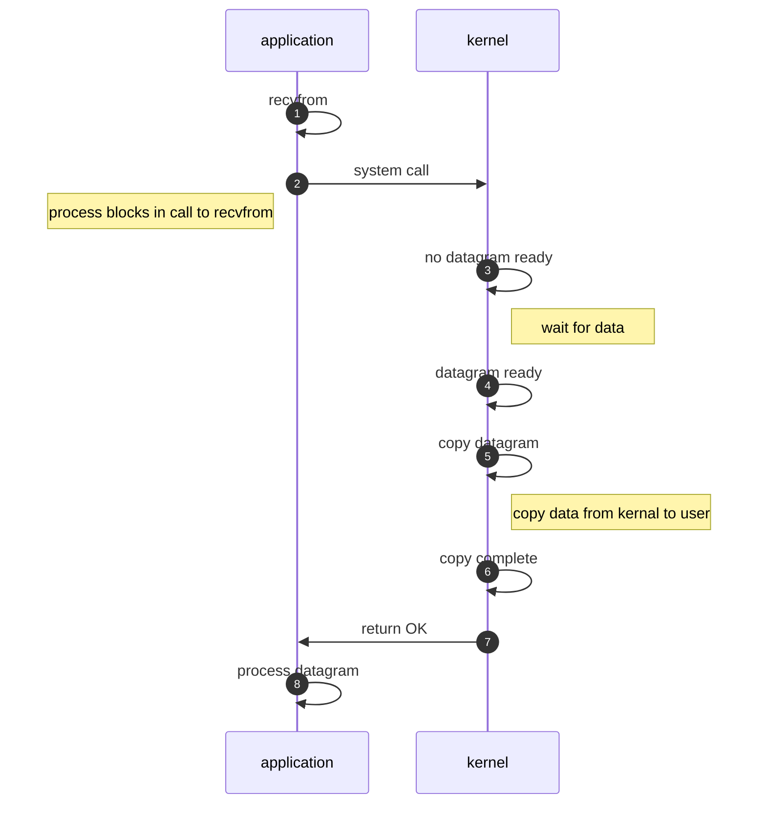
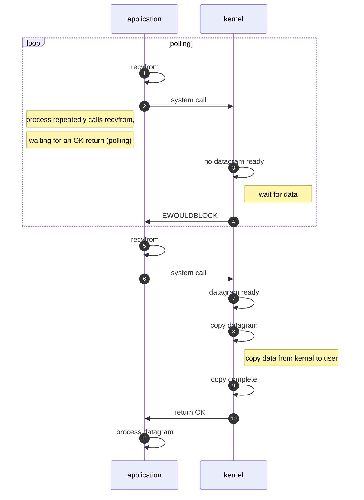
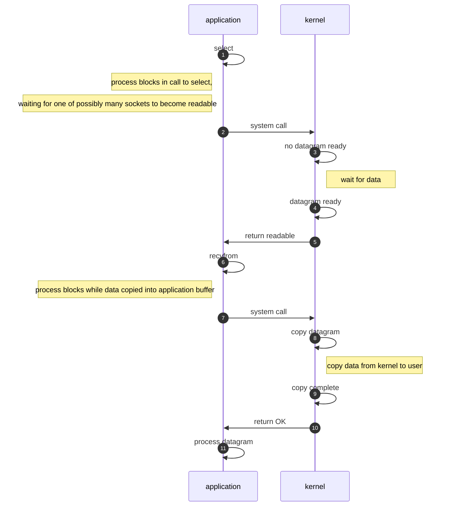
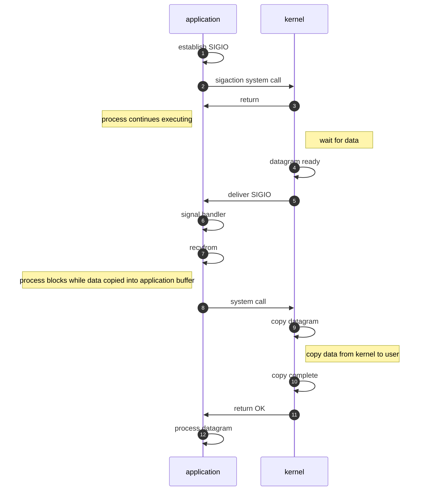
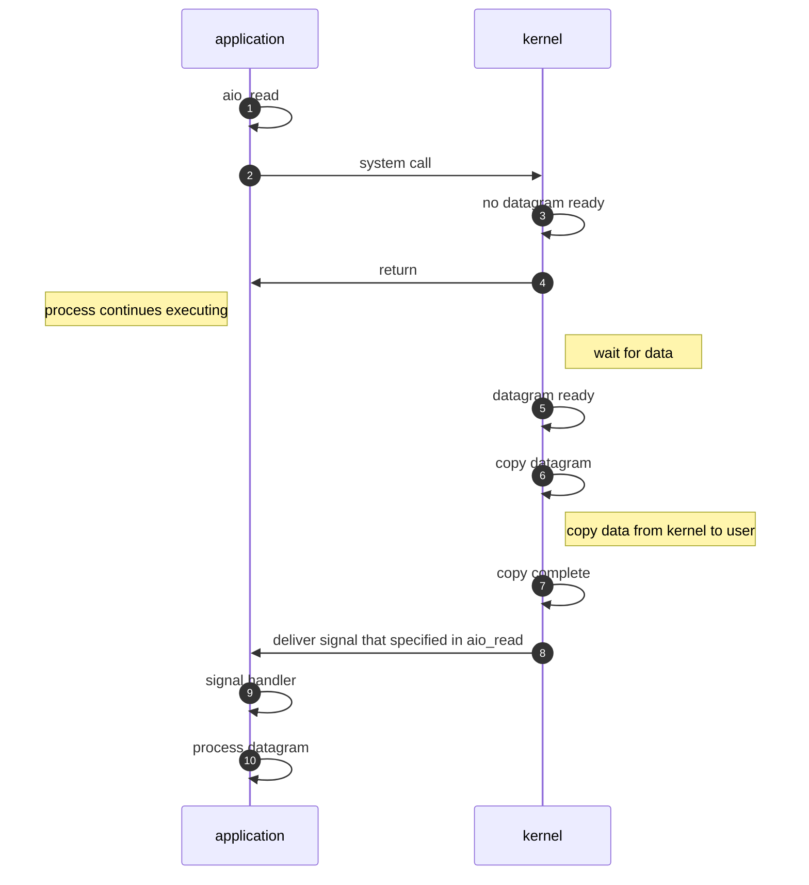

[toc]

# 各厂薪资

## 知乎整理

https://zhuanlan.zhihu.com/p/137320301

# 面经整理

参考文献：https://github.com/Flamewaker/DailySummary/blob/master/%E9%9D%A2%E7%BB%8F%E6%95%B4%E7%90%86.md

## Linux

### Linux五种IO模型

#### 阻塞IO模型



This mode is very simple. The system calls **recvfrom** After the function, the thread waits until:
The first step is to load the file into kernel mode, and the second step is to load the file into user mode.


#### 非阻塞IO模型



The system keeps passing **recvfrom** Poll until the first step is completed, and then block the data from kernel state to user state in the second step. 

The non blocking IO mode here mainly refers to the first step, loading data to the kernel state. This process is non blocking, and polling is used to determine whether the data is ready in the kernel.


#### IO复用模型




The system first checks whether the kernel data is ready through select.

When the kernel data is loaded, the system calls **recvfrom** to load kernel state data into user state.

It looks like the first and second steps are blocking operations, but select can handle multiple file handles (including sockets) at the same time at a very low cost.


#### 信号驱动IO模型



The first step is to register a callback function and notify me when the kernel data is ready.

At this time, the system can do other things without blocking waiting for kernel data.

Step 2, blocking call **recvfrom**, load the kernel’s data into the user state.


#### 异步IO模型



In theory, this model is a real asynchronous model, because in the above four models, in the second step: data loading from kernel state to user state is synchronous operation.

In this model, when the system loads the file, it only needs to pass AIO_ Read registers a callback to notify the current system when the file is loaded in kernel state or user state.

In this process, the system can perform other operation tasks without waiting.


#### Summary

The first four IO models [blocking IO, non blocking IO, IO multiplexing, signal driven IO] are all synchronous IO, only the last one is truly asynchronous [asynchronous IO]

**Introduction to system call**

1. The old version of NiO in java used select mode, but later changed to epoll. Why?

Because select is a polling mode, it constantly checks the status of the file handle.
Epoll is a callback mode. When the file handle is ready, it can directly callback, which is more efficient.

2. Does java have a real AIO mode?

Under Windows system, it is realized by IOCP.
In Linux system, no, because the underlying AIO layer of Linux system is still epoll.
(I guess that’s why netty uses NiO instead of AIO)

**outside the box**

In the form of dialogue, it is easy to understand
Ramble: how to explain to girlfriend what are the five IO models of Linux?

The kernel state and user state of data are also mentioned in this article. At the same time, efficient data transmission methods are introduced:
**zero-copy**, No copy operation between user state and kernel state


## Java基础


### String、StringBuilder和StringBuffer的区别？

1. 线程安全的区别

   * String是线程安全的
     * String 的 char[] 是 final 的，是常量

   * StringBuilder不是线程安全的
     * StringBuilder的 char[] 不是 final 的，是变量

   * StringBuffer继承了StringBuilder，但StringBuffer是线程安全的
     * StringBuffer每个方法都是syncronized关键字修饰

2. 字符串长度是否可变的区别
   * String长度是不可变的
     * String 的 char[] 是 final 的，是常量
   * StringBuffer和StringBuilder长度是可以改变的
     * StringBuilder 和 StringBuffer 的 char[] 不是 final 的
     * StringBuilder扩容方法ensureCapacityInternal()，核心调用了Arrays.copy()


### 创建对象的方式有哪几种?

1. new Object();
2. Object.clone();       // native 方法，需要Cloneable接口
3. Some.class.getConstructor(Class<?>...clazz).newInstance();      // 反射机制
4. ObjectInputStream.readObject();      // Java反序列化，需要Serializable接口实现readObject()方法


### 赋值、深拷贝和浅拷贝的区别？

这三者的区别如下，不过比较的前提都是**针对引用类型**：

- 当我们把一个对象赋值给一个新的变量时，**赋的其实是该对象的在栈中的地址，而不是堆中的数据**。也就是两个对象指向的是同一个存储空间，无论哪个对象发生改变，其实都是改变的存储空间的内容，因此，两个对象是联动的。
- 浅拷贝：重新在堆中创建内存，拷贝前后对象的基本数据类型互不影响，但拷贝前后对象的引用类型因共享同一块内存，会相互影响。
- 深拷贝：从堆内存中开辟一个新的区域存放新对象，对对象中的子对象进行递归拷贝,拷贝前后的两个对象互不影响。

举例：

1. 引用赋值：String str = "hello";
2. 值赋值：int i = 1;
3. 浅拷贝：Object.clone();
4. 深拷贝：JSONObject.fromJSON(String json);


### 内存泄露和内存溢出的区别？

内存泄漏：指无用对象（不再使用的对象）持续占有内存或无用对象的内存得不到及时释放，从而造成内存空间的浪费称为内存泄漏

内存溢出：指程序运行过程中无法申请到足够的内存而导致的一种错误。内存溢出通常发生于OLD段或Perm段垃圾回收后，仍然无内存空间容纳新的Java对象的情况

两者关系：如果内存泄漏的错误一直不处理，在有限内存空间的条件下，最终一定会出现内存溢出的错误，抛出OutOfMemoryError异常


### 强引用，弱引用，软引用，虚引用的区别？

参考文献：https://www.cnblogs.com/CodeBear/p/12447554.html


1. 强引用：被强引用关联的对象不会被回收，使用 new 一个新对象的方式来创建强引用

   ```java
   Object obj = new Object();   // 创建
   obj = null;                  // 取消关联以便回收
   System.gc();                 // 手动gc可回收
   ```

2. 软引用：被软引用关联的对象只有在内存不够的情况下才会被回收，使用 SoftReference 类来创建软引用

   ```java
   SoftReference<Object> objSoftReference = new SoftReference<>(new Object());    // 创建
   Object obj = objSoftReference.get();             // 获取
   System.gc();                                     // 内存不够的情况下才会被回收，手动gc不可回收
   ```

3. 弱引用：被弱引用关联的对象一定会被回收，即它只能存活到下一次垃圾回收发生之前，使用 WeakReference 类来创建弱引用

   ```java
   WeakReference<Object> weakReference = new WeakReference<>(new Object());       // 创建
   Object obj = weakReference.get();                // 获取
   System.gc();                                     // 手动gc可回收
   // ThreadLocal、WeakHashMap 有用到弱引用
   ```

4. 虚引用：一个对象是否有虚引用的存在，不会对其生存时间造成影响，也无法通过虚引用得到一个对象；虚引用必须与ReferenceQueue一起使用，当GC准备回收一个对象，如果发现它还有虚引用，就会在回收之前，把这个虚引用加入到与之关联的ReferenceQueue中。

   ```java
   ReferenceQueue queue = new ReferenceQueue();
   List<byte[]> bytes = new ArrayList<>();
   PhantomReference<Object> reference = new PhantomReference<Student>(new Object(),queue);
   Object obj = reference.get();        // obj == null，无法通过虚引用获取真实地址的对象
   new Thread(() -> {
       for (int i = 0; i < 100;i++ ) {
           bytes.add(new byte[1024 * 1024]);    // 逐渐增加内存直到发生gc
       }
   }).start();
   
   new Thread(() -> {
       while (true) {
           Reference poll = queue.poll();       // 发生gc时，虚引用对象被回收，并把回收通知塞到引用队列
           if (poll != null) {
               System.out.println("虚引用被回收了：" + poll);    // 发生gc时，打印这句话
           }
       }
   }).start();
   ```

   

### Java BIO、NIO和AIO的区别？

参考文献：https://developer.aliyun.com/article/726698


**同步和异步**

同步：指的是用户进程触发 IO 操作并等待或者轮询的去查看 IO 操作是否就绪。

异步：异步是指用户进程触发IO操作以后便开始做自己的事情，而当 IO 操作已经完成的时候会得到 IO 完成的通知，它的特点就是通知。

区别：IO 操作主要分为两个步骤，即发起 IO 请求和实际 IO 操作，同步与异步的区别就在于第二个步骤是否阻塞。若实际 IO 操作阻塞请求进程，即请求进程需要等待或者轮询查看 IO 操作是否就绪，则为同步 IO；若实际 IO 操作并不阻塞请求进程，而是由操作系统来进行实际 IO 操作并将结果返回，则为异步 IO。

观察角度：计算机把内存分为用户内存和系统内存两部分，同步和异步是针对应用程序(用户内存)和内核(系统内存)的交互而言的。


**阻塞和非阻塞**

阻塞：所谓阻塞方式就是指，当视图对文件描述符或者网络套接字进行读写时，如果当时没有东西可读，或者暂时不可写，程序就进入等待状态，直到有东西读或者写。

非阻塞：所谓的非阻塞方式就是指，当视图对文件描述符或者网络套接字进行读写时，如果没有东西可读，或者不可写，读写函数马上返回，无须等待。

区别：IO 操作主要分为两个步骤，即发起 IO 请求和实际 IO 操作，阻塞与非阻塞的区别就在于第一个步骤是否阻塞。若发起 IO 请求后请求线程一直等待实际 IO 操作完成，则为阻塞 IO；若发起 IO 请求后请求线程返回而不会一直等待，即为非阻塞 IO。

观察角度：阻塞和非阻塞是针对于进程在访问数据的时候，根据 IO 操作的就绪状态来采取的不同方式，说白了是一种读取或者写入操作函数的实现方式，阻塞方式下读取或者写入函数将一直等待，而非阻塞方式下，读取或者写入函数会立即返回一个状态值。


**BIO 编程模型**

采用 BIO 通信模型的服务端，通常有一个独立的 Acceptor 线程负责监听客户端的连接，它接收到客户端的连接请求之后，为每个客户端创建一个新的线程进行链路处理，处理完之后，通过输出流返回应答客户端，线程销毁。这就是典型的`一请求一应答`通信模型。这个是在多线程情况下执行的。当在单线程环境条件下时，在 while 循环中服务端会调用 accept 方法等待接收客户端的连接请求，一旦收到这个连接请求，就可以建立 socket，并在 socket 上进行读写操作，此时不能再接收其他客户端的连接请求，只能等待同当前服务端连接的客户端的操作完成或者连接断开。

该模型最大的问题就是缺乏弹性伸缩能力，当客户端并发访问量增加后，服务端的线程个数和客户端并发访问数呈 1:1 的正比关系，由于线程是 Java 虚拟机非常宝贵的系统资源，当线程数膨胀之后，系统的性能将急剧下降，随着并发访问量的继续增大，系统会发生线程堆栈溢出、创建新线程失败等问题，并最终导致进程宕机或者僵死，不能对外提供服务。


**伪异步 I/O 编程**

为了解决同步阻塞I/O面临的一个链路需要一个线程处理的问题，后来有人对它的线程模型进行了优化，后端通过一个线程池来处理多个客户端的请求接入，形成客户端个数M：线程池最大线程数N的比例关系，其中M可以远远大于N，通过线程池可以灵活的调配线程资源。设置线程的最大值，防止由于海量并发接入导致线程耗尽。
采用线程池和任务队列可以实现一种叫做伪异步的I/O通信框架。

当有新的客户端接入时，将客户端的 Socket 封装成一个 Task(该任务实现 Java.lang.Runnablle 接口)投递到后端的线程池中进行处理，JDK 的线程池维护一个消息队列和N个活跃线程对消息队列中的任务进行处理。由于线程池可以设置消息队列的大小和最大线程数，因此，它的资源占用是可控的，无论多少个客户端并发访问，都不会导致资源的耗尽和宕机。

由于线程池和消息队列都是有界的，因此，无论客户端并发连接数多大，它都不会导致线程个数过于膨胀或者内存溢出，相对于传统的一连接一线程模型，是一种改良。

伪异步I/O通信框架采用了线程池实现，因此避免了为每个请求都创建一个独立线程造成的线程资源耗尽问题。但是由于它底层的通信依然采用同步阻塞模型，因此无法从根本上解决问题。

通过对输入和输出流的 API 文档进行分析，我们了解到读和写操作都是同步阻塞的，阻塞的时间取决于对方 IO 线程的处理速度和网络 IO 的传输速度，本质上讲，我们无法保证生产环境的网络状况和对端的应用程序能足够快，如果我们的应用程序依赖对方的处理速度，它的可靠性就会非常差。


**NIO编程模型**

与 Socket 类和 ServerSocket 类对应，NIO 也提供了 SocketChannel 和 ServerSocketChannel 两种不同的套接字通道实现，在 JDK1.4 中引入。这两种新增的通道都支持阻塞和非阻塞两种模式。阻塞模式非常简单，但性能和可靠性都不好，非阻塞模式正好相反。我们可以根据自己的需求来选择合适的模式，一般来说，低负载、低并发的应用程序可以选择同步阻塞 IO 以降低编程复杂度，但是对于高负载、高并发的网络应用，需要使用 NIO 的非阻塞模式进行开发。

- (1)缓冲区 Buffer

Buffer 是一个对象，它包含一些要写入或者要读出的数据，在 NIO 库中，所有数据都是用缓冲区处理的。在读取数据时，它是直接读到缓冲区中的；在写入数据时，写入到缓冲区中，任何时候访问 NIO 中的数据，都是通过缓冲区进行操作。
缓冲区实质上是一个数组。通常它是一个字节数组(ByteBuffer)，也可以使用其他种类的数组，但是一个缓冲区不仅仅是一个数组，缓冲区提供了对数据的结构化访问以及维护读写位置(limit)等信息。常用的有ByteBuffer，其它还有CharBuffer、ShortBuffer、IntBuffer、LongBuffer、FloatBuffer、DoubleBuffer。

- (2)通道 Channel

Channel 是一个通道，可以通过它读取和写入数据，它就像自来水管一样，网络数据通过 Channel 读取和写入。通道与流的不同之处在于通道是双向的，流只是一个方向上移动(一个流必须是 InputStream 或者 OutputStream 的子类)，而且通道可以用于读、写或者用于读写。同时Channel 是全双工的，因此它可以比流更好的映射底层操作系统的API。特别是在Unix网络编程中，底层操作系统的通道都是全双工的，同时支持读写操作。我们常用到的 ServerSocketChannnel 和 SocketChannel 都是SelectableChannel 的子类。

- (3)多路复用器Selector

多路复用器 Selector 是 Java NIO 编程的基础，多路复用器提供选择已经就绪的任务的能力，简单的说，Selector 会不断的轮询注册在其上的 Channel，如果某个 Channel 上面有新的 TCP 连接接入、读和写事件，这个 Channel 就处于就绪状态，会被 Selector 轮询出来，然后通过 SelectionKey 可以获取就绪 Channel 的集合，进行后续的 I/O 操作。

一个多用复用器 Selector 可以同时轮询多个 Channel，由于 JDK 使用了 epoll() 代替传统的 select() 实现，所以它并没有最大连接句柄 1024/2048 的限制，这也意味着只需要一个线程负责 Selector 的轮询，就可以接入成千上万的客户端。

尽管 NIO 编程难度确实比同步阻塞 BIO 大很多，但是我们要考虑到它的优点：

(1)客户端发起的连接操作是异步的，可以通过在多路复用器注册 OP_CONNECT 等后续结果，不需要像之前的客户端那样被同步阻塞。

(2)SocketChannel 的读写操作都是异步的，如果没有可读写的数据它不会同步等待，直接返回，这样IO通信线程就可以处理其它的链路，不需要同步等待这个链路可用。

(3)线程模型的优化：由于 JDK 的 Selector 在 Linux 等主流操作系统上通过 epoll 实现，它没有连接句柄数的限制(只受限于操作系统的最大句柄数或者对单个进程的句柄限制)，这意味着一个 Selector 线程可以同时处理成千上万个客户端连接，而且性能不会随着客户端的增加而线性下降，因此，它非常适合做高性能、高负载的网络服务器。


**AIO编程模型**

JDK1.7 升级了 NIO 类库，升级后的 NIO 类库被称为NIO2.0。也就是我们要介绍的 AIO。NIO2.0 引入了新的异步通道的概念，并提供了异步文件通道和异步套接字通道的实现。异步通道提供两种方式获取操作结果。

(1)通过 `Java.util.concurrent.Future` 类来表示异步操作的结果；

(2)在执行异步操作的时候传入一个`Java.nio.channels.CompletionHandler`接口的实现类作为操作完成的回调。

NIO2.0 的异步套接字通道是真正的异步非阻塞 IO，它对应 UNIX 网络编程中的事件驱动 IO(AIO)，它不需要通过多路复用器(Selector)对注册的通道进行轮询操作即可实现异步读写，从而简化了 NIO 的编程模型。

我们可以得出结论：异步 Socket Channel是被动执行对象，我们不需要想NIO编程那样创建一个独立的IO线程来处理读写操作。对于`AsynchronousServerSocketChannel`和`AsynchronousSocketChannel`，它们都由 JDK 底层的线程池负责回调并驱动读写操作。正因为如此，基于 NIO2.0 新的异步非阻塞 Channel 进行编程比 NIO 编程更为简单。


### 是不是所有的对象和数组都会在堆内存分配空间？

参考文献：https://mp.weixin.qq.com/s?__biz=MzAxOTQxOTc5NQ==&mid=2650500024&idx=1&sn=0997c486387bf56bbe8ca909d55a7edf&chksm=83c88c44b4bf05521d66f6a396550cd9c8379c3fdddee1ee198968f6a9ddd172550d3329a94d&scene=21#wechat_redirect


**总结**

在Java虚拟机中，对象是在Java堆中分配内存的，这是一个普遍的常识。

但是，有一种特殊情况，那就是如果经过**逃逸分析**后发现，一个对象并没有逃逸出方法的话，那么就可能被优化成栈上分配。这样就无需在堆上分配内存，也无须进行垃圾回收了。

因此，局部变量实际上是在栈上分配的。

**如何进行逃逸分析？**

例如：-Xmx4G -Xms4G **-XX:-DoEscapeAnalysis** -XX:+PrintGCDetails -XX:+HeapDumpOnOutOfMemoryError

在Java代码运行时，通过JVM参数可指定是否开启逃逸分析，

* -XX:+DoEscapeAnalysis ：表示开启逃逸分析
* -XX:-DoEscapeAnalysis ： 表示关闭逃逸分析


### 双亲委派模型是什么？

参考文献：https://juejin.cn/post/6844903838927814669

参考文献：https://www.cnblogs.com/lanxuezaipiao/p/4138511.html

参考文献：https://www.cnblogs.com/xrq730/p/4847337.html


JVM预定义的三种类型类加载器：

- **启动（Bootstrap）类加载器**：是用本地代码实现的类装入器，它负责将 `<Java_Runtime_Home>/lib`下面的类库加载到内存中（比如`rt.jar`）。由于引导类加载器涉及到虚拟机本地实现细节，开发者无法直接获取到启动类加载器的引用，所以不允许直接通过引用进行操作。
- **标准扩展（Extension）类加载器**：是由 Sun 的 `ExtClassLoader（sun.misc.Launcher$ExtClassLoader）`实现的。它负责将`< Java_Runtime_Home >/lib/ext`或者由系统变量 `java.ext.dir`指定位置中的类库加载到内存中。开发者可以直接使用标准扩展类加载器。
- **系统（System）类加载器**：是由 Sun 的 `AppClassLoader（sun.misc.Launcher$AppClassLoader）`实现的。它负责将系统类路径（`CLASSPATH`）中指定的类库加载到内存中。开发者可以直接使用系统类加载器。

除了以上列举的三种类加载器，还有一种比较特殊的类型，**线程上下文类加载器**。


双亲委派机制描述：
某个特定的类加载器在接到加载类的请求时，首先将加载任务委托给父类加载器，**依次递归**，如果父类加载器可以完成类加载任务，就成功返回；只有父类加载器无法完成此加载任务时，才自己去加载。


如何打破双亲委派机制？

自己写一个自定义类加载器，在findClass()方法中不调用super.findClass()，直接自行读取某个路径的class字节码文件，最后用this.defineClass()方法获取Class类的对象并返回出去。在外部，Class.forName()可以指定自己写的自定义类加载器进行类加载。


### Java中Class.forName和ClassLoader的区别？

类的加载：

* 加载：通过类的全限定名获取二进制字节流，将二进制字节流转换成方法区中的运行时数据结构，在内存中生成Java.lang.class对象；

* 链接：执行下面的校验、准备和解析步骤，其中解析步骤是可以选择的；
  * 校验：检查导入类或接口的二进制数据的正确性；（文件格式验证，元数据验证，字节码验证，符号引用验证）
  * 准备：给类的静态变量分配内存并初始化内存空间；
  * 解析：将常量池中的符号引用转成直接引用；

* 初始化：激活类的静态变量的初始化Java代码和静态Java代码块，并初始化程序员设置的变量值。

在java中Class.forName()和ClassLoader都可以对类进行加载。ClassLoader就是遵循**双亲委派模型**最终调用启动类加载器的类加载器，实现的功能是通过一个类的全限定名来获取描述此类的二进制字节流，获取到二进制流后放到JVM中。classloader只干一件事情，就是将.class文件加载到jvm中，不会执行static中的内容。

Class.forName()方法实际上也是调用的CLassLoader来实现的。Class.forName()除了将类的.class文件加载到jvm中之外，还会对类进行初始化，执行类中的static块。

```java
@CallerSensitive
public static Class<?> forName(String className) throws ClassNotFoundException {
    Class<?> caller = Reflection.getCallerClass();
    return forName0(className, true, ClassLoader.getClassLoader(caller), caller);
}
```

最后调用的方法是forName0这个方法，在这个forName0方法中的第二个参数被默认设置为了true，这个参数代表是否对加载的类进行初始化，设置为true时会类进行初始化，代表会执行类中的静态代码块，以及对静态变量的赋值等操作。


### 单例模式代码

```java
// 线程安全，调用效率高，但是不能延时加载，单例未使用的时候便创建完成，可能造成资源浪费。
class Singleton1 {
    private static Singleton1 instance = new Singleton1();
    private Singleton1() {}
    public static Singleton1 getInstance() {
        return instance;
    }
}

// 线程安全，调用效率不高，但是能延时加载，线程安全通过synchronized实现
class Singleton2 {
    private static Singleton2 instance;
    private Singleton2() {}
    public static synchronized Singleton2 getSingleton() {
        if (instance == null) {
            instance = new Singleton2();
        }
        return instance;
    }
}

// 双重校验锁，线程安全，延迟加载。
// instance = new Singleton3(); 分为三个过程。
// 1. 为instance分配内存空间
// 2. 初始化instance
// 3. 将instance指向分配的内存空间
// 变量如果没有声明成volatile，多线程下会导致一个线程获得一个未初始化的实例。
// volatile 保证在JVM的内存模型中各个线程的内存可见性
class Singleton3 {
    private static volatile Singleton3 instance;
    private Singleton3() {}
    public static Singleton3 getSingleton() {
        if (instance == null) {
            synchronized (Singleton3.class) {
                if (instance == null) {
                    instance = new Singleton3();
                }
            }
        }
        return instance;
    }
}

// 静态内部类可以不依赖外部类的实例而被实例化。只有调用getSingleton()才进行初始化。
class Singleton4 {
    private Singleton4() {}
    private static class Inner {
        private static Singleton4 instance = new Singleton4();
    }
    public static Singleton4 getSingleton() {
        return Inner.instance;
    }

}
```


### Java的synchronized关键字的内置锁的锁升级过程

参考文献：https://blog.csdn.net/zqz_zqz/article/details/70233767


synchronized的执行过程：
1. 检测Mark Word里面是不是当前线程的ID，如果是，表示当前线程处于偏向锁
2. 如果不是，则使用CAS将当前线程的ID替换Mard Word，如果成功则表示当前线程获得偏向锁，置偏向标志位1
3. 如果失败，则说明发生竞争，撤销偏向锁，进而升级为轻量级锁。
4. 当前线程使用CAS将对象头的Mark Word替换为锁记录指针，如果成功，当前线程获得锁
5. 如果失败，表示其他线程竞争锁，当前线程便尝试使用自旋来获取锁。
6. 如果自旋成功则依然处于轻量级状态。
7. 如果自旋失败，则升级为重量级锁。


### Java的各种“锁”事

参考文献：https://tech.meituan.com/2018/11/15/java-lock.html


### Java线程池


## 数据库

### 联合索引那些事

参考文献：https://juejin.cn/post/6844904073955639304


## 消息队列

### 为什么使用消息队列？

参考文献：https://xie.infoq.cn/article/84f9538c7468ed89434c68686


优点：

* 解耦：解耦调用下游系统接口及其接口适配
* 异步：下游系统发生故障不影响上游系统运行，若消费失败则可重新消费。
* 削峰：充当缓冲队列，用以适配上游系统高并发写入，通过积压消息来适配下游系统低并发写入。


缺点：

* 系统可用性低：MQ挂了，整个系统都挂了
* 系统复杂度高：MQ存在消息重复消费、消息丢失、消息消费乱序
* 一致性问题：在分布式事务场景下，部分下游系统发生故障，数据如何回滚


主流MQ：

* ActiveMQ：单机吞吐量：万级；时效性：毫秒级；可用性：高；消息可靠性：小概率丢数据；
* RabbitMQ：单机吞吐量：万级；时效性：微秒级；可用性：高；消息可靠性：基本不丢；
* RocketMQ：单机吞吐量：十万级；时效性：毫秒级；可用性：非常高；消息可靠性：可配置0丢失；
* Kafka：单机吞吐量：十万级；时效性：毫秒级；可用性：非常高；消息可靠性：可配置0丢失；


### 如何保证消息队列的高可用？

参考文献：https://xie.infoq.cn/article/b73758f12905a71b1efe1b4d2


策略1：集群，集群每个节点都具备相同的数据，节点之间互不干涉，某个节点挂了也不影响集群提供服务。

策略2：主从，主节点负责读写，从节点只负责读，主节点同步数据给从节点，主节点挂了可选举从节点代替之。


RabbitMQ：普通集群模式（多节点存元数据+单节点存队列内容）、镜像集群模式（多节点存元数据和队列内容）

RocketMQ & Kafka：Broker主从 + NameServer集群


### 如何保证消息不被重复消费？

参考文献：https://xie.infoq.cn/article/72f1f64f7bca1b55d9934666b


消息被重复消费的原因：

- 生产者：生产者可能会重复推送一条数据到 MQ 中，为什么会出现这种情况呢？也许是一个 Controller 接口被重复调用了 2 次，没有做接口幂等性导致的；也可能是推送消息到 MQ 时响应比较慢，生产者的重试机制导致再次推送了一次消息。
- MQ：在消费者消费完一条数据响应 ack 信号消费成功时，MQ 突然挂了，导致 MQ 以为消费者还未消费该条数据，MQ 恢复后再次推送了该条消息，导致了重复消费。
- 消费者：消费者已经消费完了一条消息，正准备但是还未给 MQ 发送 ack 信号时，此时消费者挂了，服务重启后 MQ 以为消费者还没有消费该消息，再次推送了该条消息。


**消费端幂等性**

消费者怎么解决重复消费问题呢？这个问题解决起来也比较简单，这里提供两种方法

- 状态判断法：消费者消费数据后把消费数据记录在 redis 中，下次消费时先到 redis 中查看是否存在该消息，存在则表示消息已经消费过，直接丢弃消息。
- 业务判断法：通常数据消费后都需要插入到数据库中，使用数据库的唯一性约束防止重复消费。每次消费直接尝试插入数据，如果提示唯一性字段重复，则直接丢失消息。一般都是通过这个业务判断的方法就可以简单高效地避免消息的重复处理了。


### 如何处理消息丢失的问题？

参考文献：https://xie.infoq.cn/article/b2548617f42117436afca7f4d


消息丢失的三个原因：

* 生产者：生产者推送消息到 MQ 中，由于网络抖动等原因消息没有推送到 MQ 中，或者消息推送到 MQ 中了但是 MQ 内部出错了，导致消息丢失。
* MQ：MQ 接收到消息后先把消息暂存在 OS Cache 中，消费者还没消费的时候 MQ 自己挂了，导致消息丢失。
* 消费者：消费者消费到了这条消息，但是还没来得及处理，消费者自己挂了，但是消费者已经告诉了 MQ 自己已经消费完了，导致消息丢失。


三大MQ如何处理消息丢失问题

**RabbitMQ**

生产者方面：

RabbitMQ 有两种方案可以避免消息丢失，一种是 RabbitMQ 的事务机制，另一种是 Confirm 模式。

* RabbitMQ事务机制，提供RabbitMQ客户端Channel接口，txSelect开启事务，txCommit提交事务，txRollback回滚事务。事务整个过程都是阻塞的，性能低，几乎没人用。
* Confirm模式，生产者发送消息后，不需要等待 MQ 的回应，MQ 接收成功后，则回调生产者的 ack 接口通知生产者消息投递成功了，否则 MQ 接收失败，回调 nack 接口通知生产者消息投递失败了，生产者可以重新对这条消息进行投递。

MQ方面：

通常 RabbitMQ 接收到消息之后写入 OS Cache 中，就会给生产者返回接收成功的回应，这时如果 RabbitMQ 挂了，消息也就丢失了。解决方法可以结合生产者的 Confirm 模式，配置 RabbitMQ 持久化到磁盘之后，才给生产者返回 ack 信号。

消费者方面：

RabbitMQ 在消费者端弄丢数据，是由于 RabbitMQ 的默认自动提交 ack 导致的。解决方法就是关闭 RabbitMQ 的自动响应 ack 即可。


**Kafka**

生产者方面：

不存在丢消息的问题，生产者基本不会弄丢消息，因为生产者发送消息会等待 Kafka 响应成功，如果响应失败，生产者会自动不断地重试。

MQ方面：

Kafka 通常会一台 leader + 两台 follower，当生产者消息刚写入 leader 成功，但是还没同步到 follower 时，leader 宕机了，此时会重新选举 leader，新的 leader 由于还未同步到这条数据，导致该条消息丢失。

解决办法是做一些配置，当有其他 follower 同步到了消息后才通知生产者消息接收成功了。配置如下：

- 给 topic 设置 `replication.factor` 参数：这个值必须大于 1，要求每个 partition 必须有至少 2 个副本。
- 在 Kafka 服务端设置 `min.insync.replicas` 参数：这个值必须大于 1，这个是要求一个 leader 至少感知到有至少一个 follower 还跟自己保持联系，没掉队，这样才能确保 leader 挂了还有一个 follower。
- 在 producer 端设置 `acks=all` ：这个是要求每条数据，必须是**写入所有 replica 之后，才能认为是写成功了**。

按上面的配置配置后，就可以保证在 Kafka Broker 端就算 leader 故障了，进行新 leader 选举切换时，也不会丢失数据。

消费者方面：

Kafka 消费端弄丢数据原因跟 RabbitMQ 类似，Kafka 消费者会在接收到消息的时候，会自动提交一个 offset 给 Kafka，告诉 Kafka 消息已经处理了。处理方法也跟 RabbitMQ 类似，关闭 offset 的自动提交即可。


**RocketMQ**

RocketMQ 导致数据丢失的原因与前面的 RabbitMQ 和 Kafka 都很类似。生产者就是因为网络抖动等原因消息投递失败，或者 RocketMQ 自身的 Master 节点故障，主备切换故障之类的，消费者则有可能是异步处理导致还未处理成功就给 RocketMQ 提交了 offset 标识消息已处理了。RocketMQ还有一个补偿机制，生产者发送消息，MQ成功接收后，MQ会主动回调生产者一个预定接口来确认该消息是否应该rollback还是Ack。


**总结**

* 消费端导致的消息丢失都是由于数据还未处理成功确提前通知 MQ 消息已经处理成功了，禁止自动提交或异步操作即可，处理起来比较简单；
* 生产者和 MQ 自身导致的消息丢失则比较难处理，
  * RabbitMQ 使用了 Confirm 模式避免消息丢失；
  * Kafka 则配置所有 follower 同步成功才给生产者响应推送消息成功；
  * RocketMQ 则使用事务消息来保证消息的零丢失，针对不同的异常情况还提供了补偿机制进行处理。


### 如何保证消息的顺序性？

参考文献：https://xie.infoq.cn/article/c84491a814f99c7b9965732b1


**乱序背景**

在生产中经常会有一些类似报表系统这样的系统，需要做 MySQL 的 binlog 同步。比如订单系统要同步订单表的数据到大数据部门的 MySQL 库中用于报表统计分析，通常的做法是基于 Canal 这样的中间件去监听订单数据库的 binlog，然后把这些 binlog 发送到 MQ 中，再由消费者从 MQ 中获取 binlog 落地到大数据部门的 MySQL 中。

在这个过程中，可能会有对某个订单的增删改操作，比如有三条 binlog 执行顺序是增加、修改、删除；消费者愣是换了顺序给执行成删除、修改、增加，这样能行吗？肯定是不行的


**RabbitMQ**

乱序原因：

对于 RabbitMQ 来说，导致顺序错乱的原因通常是消费者是集群部署，不同的消费者消费到了同一订单的不同的消息，如消费者A执行了增加，消费者B执行了修改，消费者C执行了删除，但是消费者C执行比消费者B快，消费者B又比消费者A快，就会导致消费 binlog 执行到数据库的时候顺序错乱，本该顺序是增加、修改、删除，变成了删除、修改、增加。

保序方法：

RabbitMQ 的问题是由于不同的消息都发送到了同一个 queue 中，多个消费者都消费同一个 queue 的消息。解决这个问题，我们可以给 RabbitMQ 创建多个 queue，每个消费者固定消费一个 queue 的消息，生产者发送消息的时候，同一个订单号的消息发送到同一个 queue 中，由于同一个 queue 的消息是一定会保证有序的，那么同一个订单号的消息就只会被一个消费者顺序消费，从而保证了消息的顺序性。


**Kafka**

乱序原因：

对于 Kafka 来说，一个 topic 下同一个 partition 中的消息肯定是有序的，生产者在写的时候可以指定一个 key，通过我们会用订单号作为 key，这个 key 对应的消息都会发送到同一个 partition 中，所以消费者消费到的消息也一定是有序的。

那么为什么 Kafka 还会存在消息错乱的问题呢？问题就出在消费者身上。通常我们消费到同一个 key 的多条消息后，会使用多线程技术去并发处理来提高消息处理速度，否则一条消息的处理需要耗时几十 ms，1 秒也就只能处理几十条消息，吞吐量就太低了。而多线程并发处理的话，binlog 执行到数据库的时候就不一定还是原来的顺序了。

保序方法：

Kafka 从生产者到消费者消费消息这一整个过程其实都是可以保证有序的，导致最终乱序是由于消费者端需要使用多线程并发处理消息来提高吞吐量，比如消费者消费到了消息以后，开启 32 个线程处理消息，每个线程线程处理消息的快慢是不一致的，所以才会导致最终消息有可能不一致。

所以对于 Kafka 的消息顺序性保证，其实我们只需要保证同一个订单号的消息只被同一个线程处理的就可以了。由此我们可以在线程处理前增加个内存队列，每个线程只负责处理其中一个内存队列的消息，同一个订单号的消息发送到同一个内存队列中即可。


**RocketMQ**

乱序原因：

对于 RocketMQ 来说，每个 Topic 可以指定多个 MessageQueue，当我们写入消息的时候，会把消息均匀地分发到不同的 MessageQueue 中，比如同一个订单号的消息，增加 binlog 写入到 MessageQueue1 中，修改 binlog 写入到 MessageQueue2 中，删除 binlog 写入到 MessageQueue3 中。

但是当消费者有多台机器的时候，会组成一个 Consumer Group，Consumer Group 中的每台机器都会负责消费一部分 MessageQueue 的消息，所以可能消费者A消费了 MessageQueue1 的消息执行增加操作，消费者B消费了 MessageQueue2 的消息执行修改操作，消费者C消费了 MessageQueue3 的消息执行删除操作，但是此时消费 binlog 执行到数据库的时候就不一定是消费者A先执行了，有可能消费者C先执行删除操作，因为几台消费者是并行执行，是不能够保证他们之间的执行顺序的。

保序方法：

RocketMQ 的消息乱序是由于同一个订单号的 binlog 进入了不同的 MessageQueue，进而导致一个订单的 binlog 被不同机器上的 Consumer 处理。

要解决 RocketMQ 的乱序问题，我们只需要想办法让同一个订单的 binlog 进入到同一个 MessageQueue 中就可以了。因为同一个 MessageQueue 内的消息是一定有序的，一个 MessageQueue 中的消息只能交给一个 Consumer 来进行处理，所以 Consumer 消费的时候就一定会是有序的。


### 如何处理消费者故障导致的百万消息积压？

参考文献：https://xie.infoq.cn/article/a1f63436804102ca894a02f90


**为何导致消息积压？**

首先，可能是消费端出问题了，比如宕机等情况，或者消费端消费突然变得极慢，就会导致消息不断积压；也有可能是消费端依赖的服务器挂掉了，比如依赖的 NoSQL/MySQL 挂掉了，导致消费者自己没法正常运作了，导致消息的积压。


**如何解决消息积压问题？**

消息可丢的情况：

如果积压的这些消息是允许丢失的，那么很简单，马上修改消费者代码直接丢弃消息即可，这个速度会很快，所以积压消息处理起来也非常地迅速。


消息不可丢的情况：

最简单高效的办法就是临时部署足够多的消费者，一起来消费这些消息。当然，在此之前，需要先恢复系统的正常服务。

比如对于 RocketMQ 来说，原本一个 Topic 只有 4 个 MessageQueue，对应 4 个消费者。很明显如果消息积压了百万条，那么 4 个消息消费是不能够快速处理掉这一批积压消息的。我们可以修改 4 台原消费者代码，不直接处理消息，而是先把消息发送到一台新的RocketMQ 中，这台新的 RocketMQ 一个 Topic 有 20 个 MessageQueue，这时我们可以临时部署 20 个消费者一起消费这批数据，消息的消费速度提高了 5 倍，很快积压的百万消息都会被处理完毕。处理完积压的消息之后就可以下线临时部署的 20 台消费者了。


