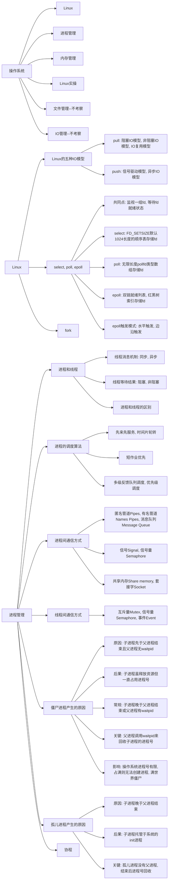

# 面经整理

[toc]

## 1 操作系统

### 1.1 思维导图

```mermaid
graph LR
  os[操作系统]
  
  linux[Linux]
  process[进程管理]


  
  os --> linuxCopy[Linux]
  os --> processCopy[进程管理]
  os --> memoryCopy[内存管理]
  os --> practiceCopy[Linux实操]
  os --> fileCopy[文件管理--不考察]
  os --> ioCopy[IO管理--不考察]
  
  linux --> linux1[Linux的五种IO模型]
  linux --> linux2[select, poll, epoll]
  linux --> linux3[fork]
  
  linux1 --> linux11[pull: 阻塞IO模型, 非阻塞IO模型, IO复用模型]
  linux1 --> linux12[push: 信号驱动模型, 异步IO模型]
  
  linux2 --> linux21[共同点: 监视一组fd, 等待fd就绪状态]
  linux2 --> linux22[select: FD_SETSIZE默认1024长度的顺序表存储fd]
  linux2 --> linux23[poll: 无限长度pollfd类型数组存储fd]
  linux2 --> linux24[epoll: 双链就绪列表, 红黑树索引存储fd]
  linux2 --> linux25[epoll触发模式: 水平触发, 边沿触发]
  
  process --> process1[进程和线程]
  process --> process2[进程的调度算法]
  process --> process3[进程间通信方式]
  process --> process4[线程间通信方式]
  process --> process5[僵尸进程产生的原因]
  process --> process6[孤儿进程产生的原因]
  process --> process7[协程]
  
  process1 --> process11[线程消息机制: 同步, 异步]
  process1 --> process12[线程等待结果: 阻塞, 非阻塞]
  process1 --> process13[进程和线程的区别]
  
  process2 --> process21[先来先服务, 时间片轮转]
  process2 --> process22[短作业优先]
  process2 --> process23[多级反馈队列调度, 优先级调度]
  
  process3 --> process33[匿名管道Pipes, 有名管道Names Pipes, 消息队列Message Queue]
  process3 --> process34[信号Signal, 信号量Semaphore]
  process3 --> process35[共享内存Share memory, 套接字Socket]
  
  process4 --> process41[互斥量Mutex, 信号量Semaphore, 事件Event]
  
  process5 --> process51[原因: 子进程先于父进程结束且父进程无waitpid]
  process5 --> process52[后果: 子进程虽释放资源但一直占用进程号]
  process5 --> process53[常规: 子进程晚于父进程结束或父进程有waitpid]
  process5 --> process54[关键: 父进程调用waitpid来回收子进程的进程号]
  process5 --> process55[影响: 操作系统进程号有限, 占满则无法创建进程, 满世界僵尸]
  
  process6 --> process61[原因: 子进程晚于父进程结束]
  process6 --> process62[后果: 子进程托管于系统的init进程]
  process6 --> process63[关键: 孤儿进程没有父进程, 结束后进程号回收]
  
  
  
  
 
  


  
```

### 1.2 Linux五种IO模型

