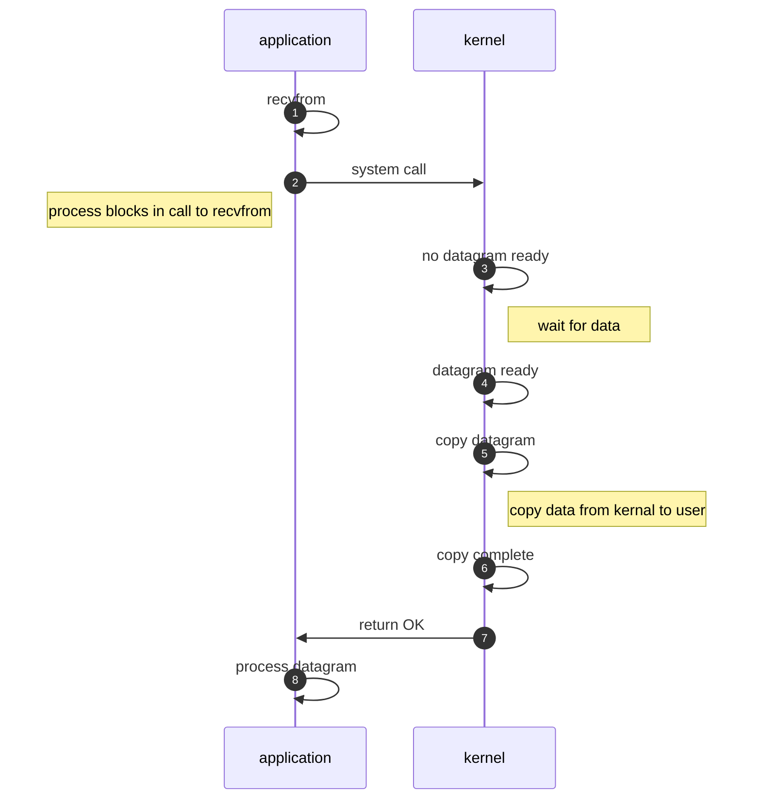
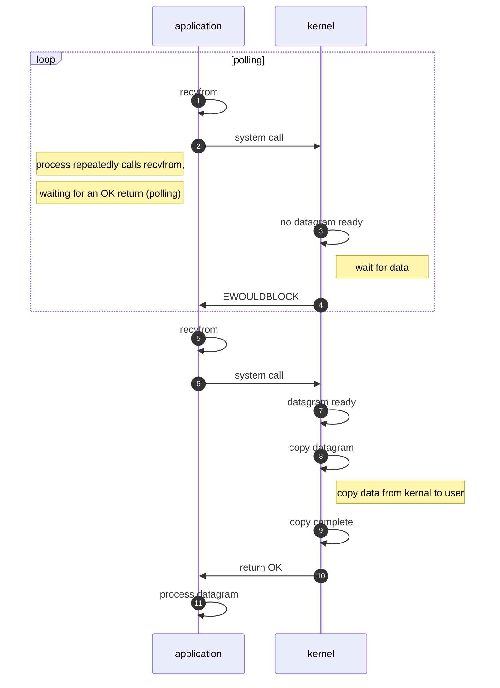
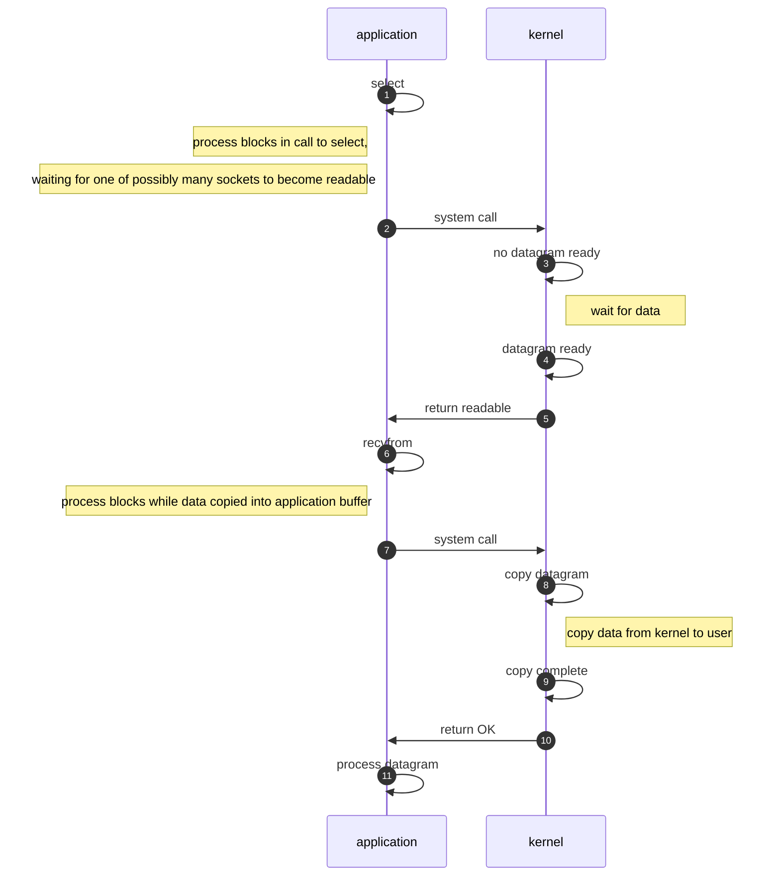
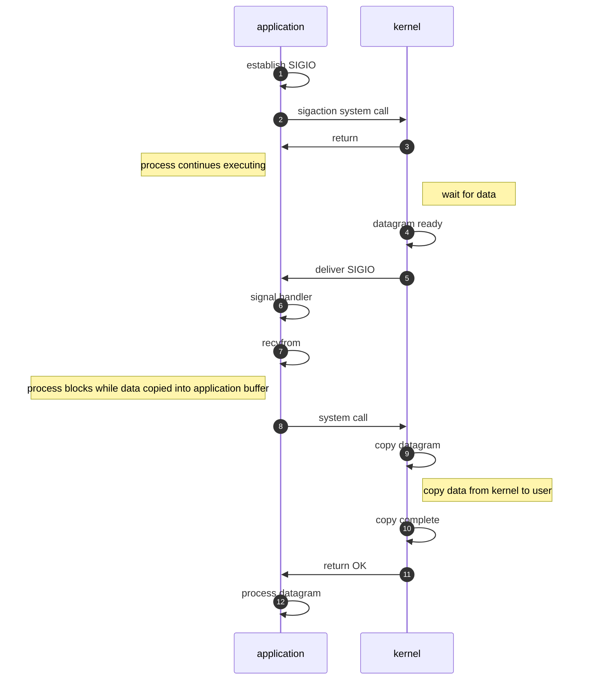
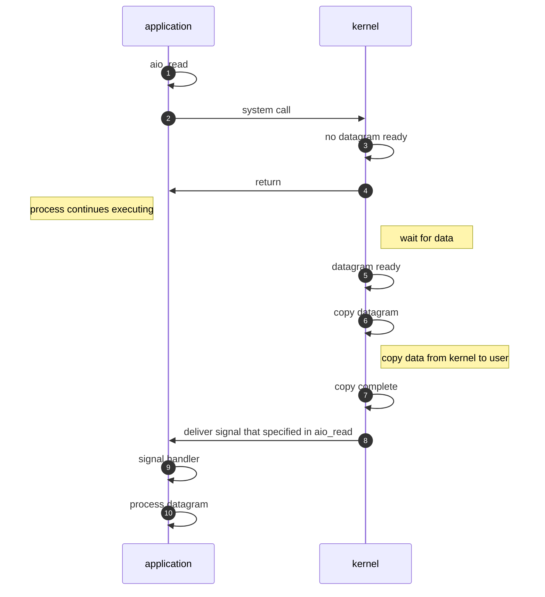

# 面经整理

[toc]

## 1 操作系统

### 1.1 思维导图

```mermaid
graph LR
  os[操作系统]
  
  linux[Linux]
  process[进程管理]
  memory[内存管理]

  os --> linuxCopy[Linux]
  os --> processCopy[进程管理]
  os --> memoryCopy[内存管理]
  os --> fileCopy[文件管理--不考察]
  os --> ioCopy[IO管理--不考察]
  
  linux --> linux1[Linux的五种IO模型]
  linux --> linux2[select, poll, epoll]
  linux --> linux3[fork]
  linux --> linux4[文件系统基础inode]
  linux --> linux5[软链接与硬链接]
  linux --> linux6[中断的分类]
  
  linux1 --> linux11[pull: 阻塞IO模型, 非阻塞IO模型, IO复用模型]
  linux1 --> linux12[push: 信号驱动模型, 异步IO模型]
  
  linux2 --> linux21[共同点: 监视一组fd, 等待fd就绪状态]
  linux2 --> linux22[select: FD_SETSIZE默认1024长度的顺序表存储fd]
  linux2 --> linux23[poll: 无限长度pollfd类型数组存储fd]
  linux2 --> linux24[epoll: 双链就绪列表, 红黑树索引存储fd]
  linux2 --> linux25[epoll触发模式: 水平触发, 边沿触发]
  
  linux3 --> linux31[作用: 在父进程中创建子进程]
  linux3 --> linux32[内核过程1: 分配内存空间创建数据结构, 复制部分父进程数据结构]
  linux3 --> linux33[内核过程2: 添加到系统进程列表, fork返回, 开始调度]
  linux3 --> linux34[特点1: 调用一次返回两次, 返回父进程pid, 返回子进程0]
  linux3 --> linux35[特点2: 并发执行, 子进程可相同但各配独立地址空间]
  linux3 --> linux36[失败原因: 系统中存在太多进程, 用户进程数量超过限制]
  
  linux4 --> linux41[每个文件都有一个inode, 存储文件的元信息]
  linux4 --> linux42[inode就是用来维护某个文件被分成几块, 每一块的信息]
  
  linux5 --> linux51[硬链接指通过索引节点inode来进行的连接]
  linux5 --> linux52[软链接保存了其代表的文件的绝对路径, 访问时替换自身路径]
  
  linux6 --> linux61[同步中断: 在指令执行时由CPU主动产生的, 受到CPU控制, 其执行点是可控的]
  linux6 --> linux62[异步中断: CPU被动接收到的, 由外设发出的电信号引起, 其发生时间不可预测]
  linux6 --> linux63[硬中断: 由硬件产生的, 会中断CPU]
  linux6 --> linux64[软中断: 由当前正在运行的进程所产生的, 不会中断CPU, 但会中断当前运行代码]
  
  process --> process1[进程和线程]
  process --> process2[进程的调度算法]
  process --> process3[进程间通信方式]
  process --> process4[线程间通信方式]
  process --> process5[僵尸进程产生的原因]
  process --> process6[孤儿进程产生的原因]
  process --> process7[协程]
  
  process1 --> process11[线程消息机制: 同步, 异步]
  process1 --> process12[线程等待结果: 阻塞, 非阻塞]
  process1 --> process13[进程和线程的区别]
  
  process2 --> process21[先来先服务, 时间片轮转]
  process2 --> process22[短作业优先]
  process2 --> process23[多级反馈队列调度, 优先级调度]
  
  process3 --> process33[匿名管道Pipes, 有名管道Names Pipes, 消息队列Message Queue]
  process3 --> process34[信号Signal, 信号量Semaphore]
  process3 --> process35[共享内存Share memory, 套接字Socket]
  
  process4 --> process41[互斥量Mutex, 信号量Semaphore, 事件Event]
  
  process5 --> process51[原因: 子进程先于父进程结束且父进程无waitpid]
  process5 --> process52[后果: 子进程虽释放资源但一直占用进程号]
  process5 --> process53[常规: 子进程晚于父进程结束或父进程有waitpid]
  process5 --> process54[关键: 父进程调用waitpid来回收子进程的进程号]
  process5 --> process55[影响: 操作系统进程号有限, 占满则无法创建进程, 满世界僵尸]
  
  process6 --> process61[原因: 子进程晚于父进程结束]
  process6 --> process62[后果: 子进程托管于系统的init进程]
  process6 --> process63[关键: 孤儿进程没有父进程, 结束后进程号回收]
  
  process7 --> process71[性质: 用户态进程管理, 有自身寄存器上下文和栈]
  process7 --> process72[优势: 用户态进程内上下文切换快, 绕过内核态进程]
  process7 --> process73[劣势: 多个协程是串行执行的, 只能在一个线程内运行, 没法利用CPU多核能力]
  process7 --> process74[关系1: 既不是进程也不是线程, 协程仅仅是一个特殊的函数]
  process7 --> process75[关系2: 一个进程可以包含多个线程, 一个线程可以包含多个协程]
  
  memory --> memory1[虚拟内存管理]
  memory --> memory2[分段和分页]
  memory --> memory3[用户态切换到内核态]
  
  memory1 --> memory11[性质: 提供连续的映射到内存或外存的逻辑空间以及内存外存的交替]
  memory1 --> memory12[页面置换算法1: OPT最佳页面置换算法, FIFO先进先出页面置换算法]
  memory1 --> memory13[页面置换算法2: LRU最近最久未使用页面置换算法, LFU最少使用页面置换算法]
  
  memory2 --> memory21[块式管理: 将内存分为几个固定大小的块, 每个块中只包含一个进程]
  memory2 --> memory22[页式管理: 把内存分为大小相等较小的页, 通过页表对应逻辑地址和物理地址]
  memory2 --> memory23[段式管理: 把内存分为若干段, 通过段表对应逻辑地址和物理地址]
  memory2 --> memory24[段页式管理: 把内存先分成若干段, 每个段又分成若干页]
  
  memory3 --> memory31[用户态主动切换: 使用系统资源]
  memory3 --> memory32[用户态被动切换: 因抛出异常]
  memory3 --> memory33[用户态被动切换: 硬件发出中断信号]
 
```

### 1.2 Linux五种IO模型

#### 1.2.1 阻塞IO模型

This mode is very simple. The system calls **recvfrom** After the function, the thread waits until:
The first step is to load the file into kernel mode, and the second step is to load the file into user mode.

#### 1.2.2 非阻塞IO模型

The system keeps passing **recvfrom** Poll until the first step is completed, and then block the data from kernel state to user state in the second step. 

The non blocking IO mode here mainly refers to the first step, loading data to the kernel state. This process is non blocking, and polling is used to determine whether the data is ready in the kernel.

#### 1.2.3 IO复用模型

The system first checks whether the kernel data is ready through select.

When the kernel data is loaded, the system calls **recvfrom** to load kernel state data into user state.

It looks like the first and second steps are blocking operations, but select can handle multiple file handles (including sockets) at the same time at a very low cost.

#### 1.2.4 信号驱动IO模型

The first step is to register a callback function and notify me when the kernel data is ready.

At this time, the system can do other things without blocking waiting for kernel data.

Step 2, blocking call **recvfrom**, load the kernel’s data into the user state.

#### 1.2.5 异步IO模型

In theory, this model is a real asynchronous model, because in the above four models, in the second step: data loading from kernel state to user state is synchronous operation.

In this model, when the system loads the file, it only needs to pass AIO_ Read registers a callback to notify the current system when the file is loaded in kernel state or user state.

In this process, the system can perform other operation tasks without waiting.

#### 1.2.6 Summary

The first four IO models [blocking IO, non blocking IO, IO multiplexing, signal driven IO] are all synchronous IO, only the last one is truly asynchronous [asynchronous IO]

**Introduction to system call**

1. The old version of NiO in java used select mode, but later changed to epoll. Why?

Because select is a polling mode, it constantly checks the status of the file handle.
Epoll is a callback mode. When the file handle is ready, it can directly callback, which is more efficient.

2. Does java have a real AIO mode?

Under Windows system, it is realized by IOCP.
In Linux system, no, because the underlying AIO layer of Linux system is still epoll.
(I guess that’s why netty uses NiO instead of AIO)

**outside the box**

In the form of dialogue, it is easy to understand
Ramble: how to explain to girlfriend what are the five IO models of Linux?

The kernel state and user state of data are also mentioned in this article. At the same time, efficient data transmission methods are introduced:
**zero-copy**, No copy operation between user state and kernel state

## 2 Java基础

### 2.1 思维导图

